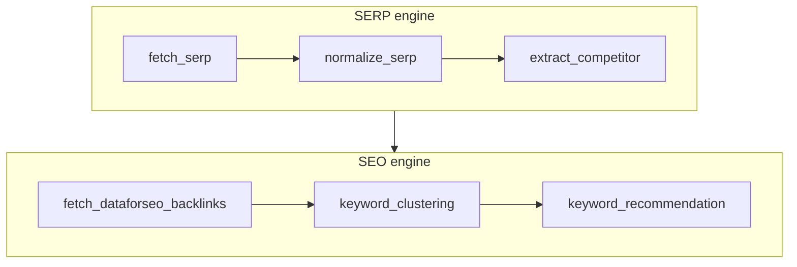

# Keyword clustering walkthrough (2026)

This document explains how keyword intent and clustering work in REXT after the **2 LLM call** design.

## Goals

- **Accurate topic clusters** (Semrush / Ahrefs style: same page / same SERP overlap).
- **Intent aligned** with the payload keyword, from **your competitor LLM**, not DataForSEO.
- **Fewer LLM calls**: 2 per keyword run (was 3).

---

## End-to-end pipeline



| Step | Node | LLM? | Output used for clustering |
|------|------|------|----------------------------|
| 1 | `fetch_serp` | No | Raw organic, PAA, related |
| 2 | `normalize_serp` | No | `serp_normalized` |
| 3 | `extract_competitor` | **Yes (1 call)** | `final_intent_type`, per-domain intent, `intent_matched_signals` |
| 4 | `fetch_dataforseo_backlinks` | No | Volume, KD, backlinks — **not used for cluster intent** |
| 5 | `keyword_clustering` | **Yes (1 call)** | `keyword_clusters` |
| 6 | `keyword_recommendation` | No | User interrupt / library |

---

## Step 3 — `competitor.py` (single LLM call)

### What the LLM returns

One batch call → `BatchSEOIntentOutput`:

- `final_intent_type` — primary keyword intent (`INFORMATIONAL` | `COMMERCIAL` | `NAVIGATIONAL` | `TRANSACTIONAL`)
- `results[]` — per competitor: `domain`, `intent`, `confidence`, `is_brand`

### What happens without a second LLM

`build_intent_matched_signals_from_competitors()` builds clustering context:

| Field | Source |
|-------|--------|
| `titles` | Top organic **title** for each competitor where `competitor.intent == final_intent_type` |
| `snippets` | Same competitors’ snippets |
| `matched_domains` | Domains that passed intent filter |
| `related_topics` | Heuristic filter (`serp_intent_heuristics.py`) |
| `questions` | Heuristic PAA filter (drops e.g. pure “what is…” on commercial SERPs) |

If **no** competitor matches (edge case), top 5 organic titles are used as fallback.

Stored on state:

```python
state["serp_normalized"]["intent_matched_signals"]
state["final_intent_type"]
state["seo_result"]["intent_type"]
```

---

## Step 5 — `keyword_clustering.py`

### Primary intent (no DataForSEO)

`resolve_primary_intent()` uses **only**:

1. `state["final_intent_type"]` (competitor LLM)
2. `seo_result["intent_type"]`
3. `intent_matched_signals["primary_intent"]`

`serp_backlinks.main_intent` from DataForSEO is **ignored** for clustering.

### TF-IDF candidates (local, no LLM)

`KeywordExtractor.extract_keywords()` with:

- `intent_matched_titles` → title document = matched competitor titles only
- `intent_matched_domains` → snippet document = those domains only
- `related_topics` / `questions` = heuristic-filtered lists from signals

Top **30** candidates go to the clustering LLM.

### Clustering LLM

`KeywordClusteringService.cluster_keywords()`:

- System prompt: primary intent + competitor titles/snippets/PAA/related
- Structured output: 3–6 clusters, parent keyword, theme, rationale
- Post-process: **dedupe** keywords so each phrase appears in one cluster only

---

## State shape (clustering output)

```json
{
  "cluster_name": "best seo tools",
  "topic_theme": "tool comparisons",
  "main_intent": "commercial",
  "total_score": 600.0,
  "rationale": "...",
  "keywords": [
    { "keyword": "best seo tools", "score": 100.0, "rank": 1, ... }
  ]
}
```

---

## Files reference

| File | Role |
|------|------|
| `src/flow/engines/serp/competitor.py` | 1× LLM intent + build `intent_matched_signals` |
| `src/flow/engines/serp/serp_intent_heuristics.py` | PAA / related filters (no LLM) |
| `src/flow/engines/seo/keyword_clustering.py` | LangGraph node |
| `src/services/keyword_clustering_service.py` | Clustering LLM + dedupe |
| `src/services/keyword_service.py` | TF-IDF with intent-matched corpus |
| `src/flow/prompts/system/keyword_clustering.py` | Clustering prompt |

---

## Run locally

```bash
.\.venv\Scripts\python.exe scripts/run_keyword_clustering_live.py "best seo tools" us
```

Requires `DATAFORSEO_*` and `OPENAI_API_KEY` in `.env`.

---

## Design decisions

1. **Why competitor titles only?**  
   URLs ranking with the same intent as the keyword are the best proxy for “which keywords belong on one page.”

2. **Why heuristics for PAA/related?**  
   Saves 1 LLM call; related searches are usually same-intent; PAA is mixed and benefits from rules.

3. **Why keep DataForSEO?**  
   Still used in UI for volume/KD/backlinks in `keyword_recommendation`, not for cluster intent.

4. **Why 2 LLM calls not 1?**  
   Merging competitor analysis + clustering in one prompt hurts schema reliability and mixes two different tasks.

---

## Troubleshooting

| Symptom | Check |
|---------|--------|
| Empty clusters | SERP fetch returned 0 organic; API keys |
| `UNKNOWN` intent | Competitor LLM failed; check logs |
| No PAA in signals | Heuristic filtered all; expected on commercial queries |
| Intent differs from DataForSEO | By design — competitor LLM wins for clustering |
